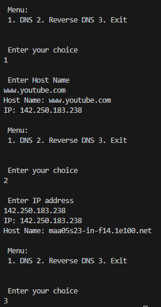

# Distributed System Lab Programs
[Lab Manula](./DIS Lab Manual 2020-21.pdf)

1. Implementation FTP : Java
   - [client](./FTPClient.java)
   - [server](./FTPServer.java)
2. Implementation of Name Server : Java
   - [DNS](./DNS.java)
   - 
3. Implementation of Chat Server : Java
   - [CCLogin.java](./CCLogin.java)
   - [ChatMultiServer:](./ChatMultiServer.java)
   - [Client1](./Client1.java)
